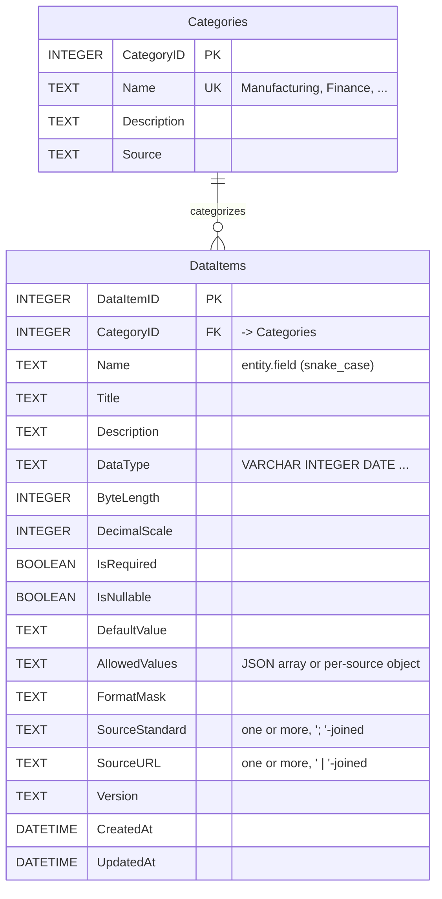
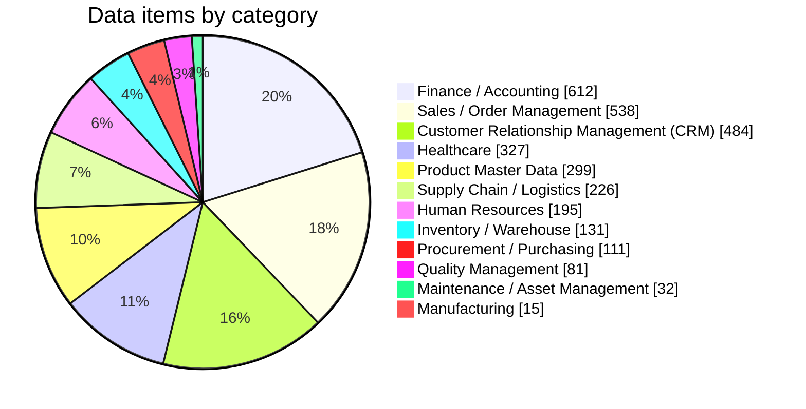
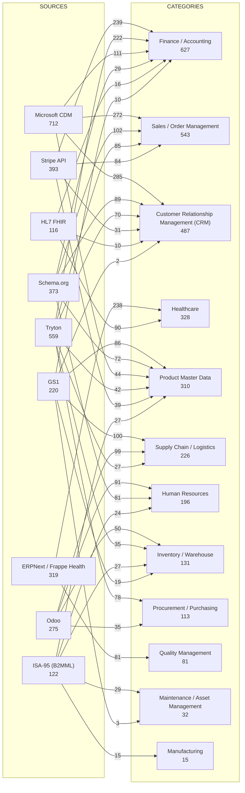

# Data Model & Diagrams

_Auto-generated by `tools/gen_diagram.py` from `datadict.db` on 2026-06-14 — 3051 items, 12 categories, 9 sources._

> Diagrams use [Mermaid](https://mermaid.js.org/), which renders natively on GitHub. Static **SVG/PNG** exports live in [`diagrams/`](diagrams/) — regenerate them with `python3 tools/render_diagrams.py`.

| Diagram | SVG | PNG |
|---|---|---|
| ER diagram | [er-diagram.svg](diagrams/er-diagram.svg) | [er-diagram.png](diagrams/er-diagram.png) |
| Categories | [categories.svg](diagrams/categories.svg) | [categories.png](diagrams/categories.png) |
| Source→Category map | [source-category-map.svg](diagrams/source-category-map.svg) | [source-category-map.png](diagrams/source-category-map.png) |

## 1. Entity-Relationship diagram

The dictionary is a simple two-table star: many `DataItems` per `Category`.

## 2. Categories by item count

## 3. Which sources feed which categories

Edge labels = number of items each source contributes to a category.

## 4. Source contribution matrix

| Category | Microsoft CDM | Tryton | Stripe API | Schema.org | ERPNext / Frappe Health | Odoo | GS1 | ISA-95 (B2MML) | HL7 FHIR | **Total\*** |
|---|---|---|---|---|---|---|---|---|---|---|
| Finance / Accounting | 111 | 222 | 239 | 29 |  |  | 10 |  | 16 | **627** |
| Sales / Order Management | 272 | 85 | 84 | 102 |  |  |  |  |  | **543** |
| Customer Relationship Management (CRM) | 285 | 70 | 31 | 89 |  |  | 2 |  | 10 | **487** |
| Healthcare |  |  |  |  | 238 |  |  |  | 90 | **328** |
| Product Master Data | 44 | 42 | 39 | 72 |  |  | 86 | 27 |  | **310** |
| Supply Chain / Logistics |  | 27 |  |  |  | 99 | 100 |  |  | **226** |
| Human Resources |  |  |  | 81 |  | 91 |  | 24 |  | **196** |
| Inventory / Warehouse |  | 35 |  |  |  | 50 | 19 | 27 |  | **131** |
| Procurement / Purchasing |  | 78 |  |  |  | 35 |  |  |  | **113** |
| Quality Management |  |  |  |  | 81 |  |  |  |  | **81** |
| Maintenance / Asset Management |  |  |  |  |  |  | 3 | 29 |  | **32** |
| Manufacturing |  |  |  |  |  |  |  | 15 |  | **15** |
| **Total\*** | **712** | **559** | **393** | **373** | **319** | **275** | **220** | **122** | **116** | |

\* Contribution totals count an item once **per source** it carries, so cross-source-merged items are counted in each contributing source; these totals therefore exceed the 3051 distinct items.
