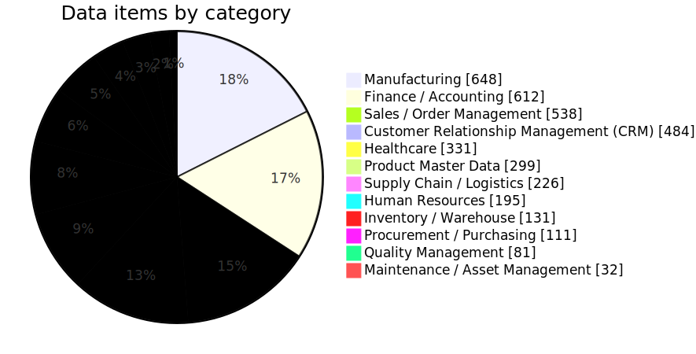
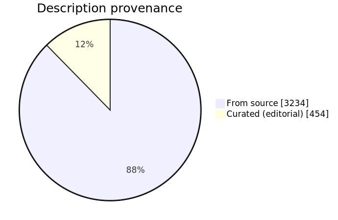

# Business Application Data Dictionary

A comprehensive, **open-source** business data dictionary stored in SQLite
(`datadict.db`, with a full schema + data dump in `datadict.sql`). It collects
standardized business data items across major industries and functional areas,
extracted **only from public / open-source resources**.

> **3,688 data items · 12 categories · 9 open-source standards** &nbsp;|&nbsp;
> 31 items corroborated across multiple sources.

---

## Contents by category

| Category | Items | Category | Items |
|---|---:|---|---:|
| Manufacturing | 648 | Supply Chain / Logistics | 226 |
| Finance / Accounting | 612 | Human Resources | 195 |
| Sales / Order Management | 538 | Inventory / Warehouse | 131 |
| Customer Relationship Management (CRM) | 484 | Procurement / Purchasing | 111 |
| Healthcare | 331 | Quality Management | 81 |
| Product Master Data | 299 | Maintenance / Asset Management | 32 |

## Sources (all public / open-source)

| Standard | License | Items |
|---|---|---:|
| Microsoft Common Data Model (CDM) | CDLA-Permissive-2.0 | 712 |
| Tryton | GPL-3.0 | 634 |
| ERPNext / Frappe Health | GPL-3.0 | 610 |
| Odoo | LGPL-3.0 | 546 |
| Stripe API (OpenAPI) | MIT | 393 |
| Schema.org | CC BY-SA 3.0 | 373 |
| GS1 (Barcode Syntax Dictionary) | Apache-2.0 | 220 |
| ISA-95 / B2MML | Royalty-free (MESA) | 122 |
| HL7 FHIR (R4) | CC0 (public domain) | 116 |

Full provenance and extraction notes: **[`sources.md`](sources.md)**.

## Diagrams

Schema and source/category maps live in **[`DATA_MODEL.md`](DATA_MODEL.md)**
(Mermaid, renders on GitHub) with static **SVG/PNG** exports in
[`diagrams/`](diagrams/):

| | |
|---|---|
| [ER diagram](diagrams/er-diagram.svg) | two-table star: `Categories` → `DataItems` |
| [Categories](diagrams/categories.svg) | items per category (pie) |
| [Description coverage](diagrams/description-coverage.svg) | description provenance: from-source vs curated (pie) |
| [Source→Category map](diagrams/source-category-map.svg) | which standards feed which categories |



Every item is described (**100% coverage**) — 3,234 descriptions come straight
from the upstream source and 454 are curated editorial text added where the
source provided none:



---

## Quick start

```bash
# Build / refresh datadict.db and datadict.sql from the seed modules
python3 build_dict.py

# Print summary statistics only (no rebuild)
python3 build_dict.py --stats

# Query the database
sqlite3 datadict.db "SELECT * FROM DataItems WHERE CategoryID = 1 LIMIT 10;"
```

The build is **idempotent** — re-running never creates duplicates. To rebuild
from scratch, delete `datadict.db` first (it is fully regenerable from the
seeds). See the **[Query Cookbook](QUERY_COOKBOOK.md)** for ready-to-run SQL.

---

## Schema

```sql
CREATE TABLE Categories (
    CategoryID  INTEGER PRIMARY KEY,
    Name        TEXT NOT NULL UNIQUE,   -- "Manufacturing", "Finance", ...
    Description TEXT,
    Source      TEXT
);

CREATE TABLE DataItems (
    DataItemID   INTEGER PRIMARY KEY,
    CategoryID   INTEGER NOT NULL REFERENCES Categories(CategoryID),
    Name         TEXT NOT NULL,         -- normalized "entity.field" (snake_case)
    Title        TEXT,
    Description  TEXT,
    DataType     TEXT,                  -- VARCHAR, INTEGER, DECIMAL, DATE, ...
    ByteLength   INTEGER,
    DecimalScale INTEGER,
    IsRequired   BOOLEAN DEFAULT FALSE,
    IsNullable   BOOLEAN DEFAULT TRUE,
    DefaultValue TEXT,
    AllowedValues TEXT,                 -- JSON array, or per-source JSON object
    FormatMask    TEXT,                 -- e.g. "YYYY-MM-DD", GS1 "N14,csum"
    SourceStandard TEXT,                -- one or more "; "-joined standards
    SourceURL      TEXT,                -- one or more " | "-joined URLs
    Version        TEXT,
    CreatedAt DATETIME DEFAULT CURRENT_TIMESTAMP,
    UpdatedAt DATETIME DEFAULT CURRENT_TIMESTAMP
);

CREATE INDEX idx_dataitems_category ON DataItems(CategoryID);
CREATE INDEX idx_dataitems_name     ON DataItems(Name);
-- Idempotency key for upserts:
CREATE UNIQUE INDEX ux_dataitems_natural
    ON DataItems(CategoryID, Name, SourceStandard);
```

### Two field conventions worth knowing

- **`Name`** is normalized to `entity.field` in **snake_case** (e.g.
  `account.account_id`, `product.gtin`). The entity is everything before the
  last dot.
- **`SourceStandard` / `SourceURL`** hold a **`; `-** / **` | `-joined list**
  when an item was corroborated by more than one source (a cross-source merge).
- **`AllowedValues`** is usually a **JSON array** (`["male","female","other"]`).
  When merged sources have *divergent* enums, it becomes a **JSON object keyed
  by source** (e.g. `purchase_order.state`). Consumers should handle both.

---

## How it's built

```
build_dict.py          # orchestrator: schema, load seeds, normalize, export, stats
normalize.py           # Phase 3: snake_case naming, entity/field aliases,
                        #          cross-source merge, per-source enum union
seeds/                 # one module per source (CATEGORIES + ITEMS); some
                        #   are auto-generated by the tools below
tools/fetch_*.py       # generators that (re)build seed modules from upstream
datadict.db            # the SQLite database (build output)
datadict.sql           # full schema + INSERTs (build output)
sources.md             # every source, license, and extraction method
NORMALIZATION_REPORT.md # auto-generated: aliases, merges, related concepts
DATA_MODEL.md          # auto-generated Mermaid ER + category/source diagrams
QUERY_COOKBOOK.md      # ready-to-run SQL recipes
PROGRESS.md            # running build log
```

### Pipeline (4 phases)

1. **Discovery** — explore each open repo/spec for business entities.
2. **Extraction** — `tools/fetch_*.py` parse upstream schemas (XSD, JSON-LD,
   Python `ast`, DocType JSON, OpenAPI, FHIR StructureDefinitions) into seed
   modules. Each is re-runnable to refresh from upstream.
3. **Normalization** (`normalize.py`) — consistent snake_case names; deliberate,
   reviewable **entity aliases** (e.g. `account.invoice` → `invoice`) and
   **field aliases** (e.g. `gs1.gtin` → `product.gtin`); conservative
   cross-source **merge** (same `entity.field` in the same category) that keeps
   the richest metadata and records all sources; per-source **enum union**.
4. **SQLite generation** — `datadict.db` + `datadict.sql`, plus stats and the
   normalization report.

### Regenerating a single source

```bash
python3 tools/fetch_cdm.py        # Microsoft CDM   -> seeds/cdm_microsoft.py
python3 tools/fetch_odoo.py       # Odoo            -> seeds/odoo.py
python3 tools/fetch_frappe.py     # ERPNext+Health  -> seeds/frappe.py
python3 tools/fetch_schemaorg.py  # Schema.org      -> seeds/schemaorg.py
python3 tools/fetch_tryton.py     # Tryton          -> seeds/tryton.py
python3 tools/fetch_gs1.py        # GS1             -> seeds/gs1.py
python3 tools/fetch_fhir.py       # HL7 FHIR        -> seeds/fhir.py
python3 tools/fetch_openapi.py    # OpenAPI (Stripe)-> seeds/openapi.py
python3 build_dict.py             # then rebuild the DB
python3 tools/gen_diagram.py      # refresh DATA_MODEL.md from the DB
python3 tools/render_diagrams.py  # render diagrams/*.svg + *.png (Chromium or mmdc)
```

(ISA-95 / B2MML lives in a hand-curated `seeds/isa95_b2mml.py`.)

### Adding a new source

Create a `seeds/<name>.py` exposing two lists — `CATEGORIES` and `ITEMS`
(each item a dict with at least `category` and `name`) — then run
`python3 build_dict.py`. For OpenAPI/Swagger specs, just add an entry to
`SPECS` in `tools/fetch_openapi.py`.

---

## Requirements

Python 3 standard library only (`sqlite3`, `json`, `ast`, `urllib`,
`re`). No third-party packages. The `tools/fetch_*.py` generators need network
access to reach the upstream repos; `build_dict.py` works fully offline from
the committed seed modules.

## Contributing

Contributions — new open-source sources, corrections, better descriptions,
tooling — are welcome. See **[CONTRIBUTING.md](CONTRIBUTING.md)** for the
seed-module contract, how to add a source, the aliasing/merge rules, and the
pre-PR checklist. Core rule: **public/open-source sources only, accuracy over
quantity, always record provenance.**

## License & attribution

This repository is **dual-licensed** to reflect its two layers:

- **Code** — the build/generator scripts (`build_dict.py`, `normalize.py`,
  `tools/*.py`) and the project's documentation are licensed under the
  **[MIT License](LICENSE)**.
- **Data** — `datadict.db` / `datadict.sql` is a compilation derived from
  multiple open sources. The original compilation, arrangement, and this
  project's own descriptions are licensed under **[Creative Commons
  Attribution-ShareAlike 4.0 International (CC BY-SA 4.0)](DATA_LICENSE)**.

**Upstream terms still apply per item.** Individual data items remain subject
to the license of the source they came from, recorded in each row's
`SourceStandard` / `SourceURL` and summarized in [`sources.md`](sources.md):
HL7 FHIR (CC0), Stripe (MIT), GS1 (Apache-2.0), Microsoft CDM
(CDLA-Permissive-2.0), Schema.org (CC BY-SA 3.0), Odoo (LGPL-3.0),
ERPNext/Frappe Health & Tryton (GPL-3.0), ISA-95/B2MML (MESA royalty-free).
If you redistribute the data, **provide attribution** (the per-item source
fields + `sources.md` satisfy this) and honor each upstream license —
particularly Schema.org's ShareAlike and the copyleft (GPL) sources.

No paywalled, proprietary, or scraped commercial content is included.

> Not legal advice. This dual-license setup is a good-faith, conservative
> reflection of the sources; consult a professional for your specific use.
